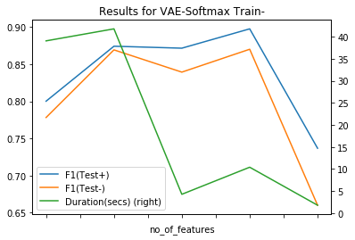
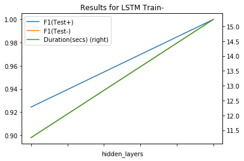

```python
import pandas as pd
import numpy as np
import warnings
from scipy import stats
from IPython.display import display, HTML
from sklearn import metrics as me

warnings.filterwarnings('ignore')
pd.set_option("display.max_rows",20)
pd.set_option('precision', 4)

%matplotlib inline
```


```python
import numpy as np
import matplotlib.pyplot as plt
import itertools

def plot_confusion_matrix(cm, classes,
                          normalize=False,
                          title='Confusion matrix',
                          cmap=plt.cm.Blues):
    """
    This function prints and plots the confusion matrix.
    Normalization can be applied by setting `normalize=True`.
    """
    np.set_printoptions(precision=4)

    plt.imshow(cm, interpolation='nearest', cmap=cmap)
    plt.title(title)
    plt.colorbar()
    tick_marks = np.arange(len(classes))
    plt.xticks(tick_marks, classes, rotation=45)
    plt.yticks(tick_marks, classes)

    if normalize:
        cm = cm.astype('float') / cm.sum(axis=1)[:, np.newaxis]
        #print("Normalized confusion matrix")
    else:
        #print('Confusion matrix, without normalization')
        pass
    
    #print(cm)

    label = [["\n True Negative", "\n False Positive \n Type II Error"],
             ["\n False Negative \n Type I Error", "\n True Positive"]
            ]
    
    thresh = cm.max() / 2.
    for i, j in itertools.product(range(cm.shape[0]), range(cm.shape[1])):
        
        plt.text(j, i, "{} {}".format(cm[i, j].round(4), label[i][j]),
                 horizontalalignment="center",
                 color="white" if cm[i, j] > thresh else "black")

    plt.tight_layout()
    plt.ylabel('True label')
    plt.xlabel('Predicted label')

def plot(actual_value, pred_value):
    from sklearn.metrics import confusion_matrix

    cm_2labels = confusion_matrix(y_pred = pred_value, y_true = actual_value)
    plt.figure(figsize=[6,6])
    plot_confusion_matrix(cm_2labels, ['Normal', 'Attack'], normalize = False)

```


```python

def evaluate_lstm(model, past_scores, past_scores_20, predictions, predictions_, predictions_20, predictions_20_):
    return evaluate(model, past_scores, past_scores_20, predictions, predictions_, predictions_20, predictions_20_, 'LSTM')

def display_and_save(name, plot):
    fig = plot.get_figure()
    fig.savefig("result_plots/{}.eps".format(name.replace(":","").strip()), format='eps', dpi=1000)
    fig.savefig("result_plots/{}.png".format(name.replace(":","").strip()), format='png', dpi=1000)
    display(plot)

def evaluate(model, past_scores, past_scores_20, predictions, predictions_, predictions_20, predictions_20_, model_type='AE'):
    all_scenarios = pd.DataFrame(columns=['Scenarios', 'Number of Features', 'Accuracy', 'F1 Score', 'Precision', 'Recall'])
    
    def get_best_df(past_scores):
        psg = past_scores.sort_values(by='f1_score', ascending=False).groupby(by=['no_of_features', 'hidden_layers'])
        df = psg.first().sort_values(by='f1_score', ascending=False)
        return df
    
    def get_result(past_scores):
            
        df = get_best_df(past_scores)
        
        #epoch_nof_hidden
        key = int(df.iloc[0]['epoch'])
        nof = int(df.iloc[0].name[0])
        hidden = int(df.iloc[0].name[1])
        
        return "{}_{}_{}".format(key, nof, hidden), nof, df

    def view_data(name, past_scores):
        _, _, df = get_result(past_scores)
        #display(name)
        #display(df)
        
        group_by = 'no_of_features'
        if(model_type == 'LSTM'):
            group_by = 'hidden_layers'
        df1 = df.reset_index().sort_values(by='f1_score', ascending=False).groupby(by=[group_by])
        
        df1 = df1.first().loc[:,['f1_score', 'f1_score_20', 'time_taken']]
        df1 = df1.rename(index={1:"One", 12:"10%", 24:"20%", 48:"40%", 122:"All"})
        df1 = df1.rename(columns={"f1_score":"F1(Test+)", "f1_score_20":"F1(Test-)", "time_taken":"Duration(secs)"})
        plot = df1.plot(secondary_y = 'Duration(secs)', title=name)#,figsize=(10, 10))
        display_and_save(name, plot)
    
        
    #display("Individual Results for each Scenario")    
    view_data("Results for {} Train+".format(model),past_scores)
    view_data("Results for {} Train-".format(model),past_scores_20)
        
    def get_score(y_true, y_pred):
        f1 = me.f1_score(y_true, y_pred)
        pre = me.precision_score(y_true, y_pred)
        rec = me.recall_score(y_true, y_pred)
        acc = me.accuracy_score(y_true, y_pred)
        return {"F1 Score":f1, "Precision":pre, "Recall":rec, "Accuracy":acc}
    
    display("Combined Results from all Scenarios for {}".format(model))

    
    def accumulate_scenarios(predictions, past_scores):
        key, nof, df = get_result(past_scores)
        y_true = predictions[key]["Actual"]
        y_pred = predictions[key]["Prediction"]
        scores = get_score(y_true, y_pred)
        scores.update({"Model":model,"Scenarios":scenario,"Number of Features":nof})
        
        return pd.DataFrame(scores, index=[1])
    
    scenario = "Train+_Test+"
    all_scenarios = all_scenarios.append(accumulate_scenarios(predictions, past_scores))
    
    scenario = "Train+_Test-"
    all_scenarios = all_scenarios.append(accumulate_scenarios(predictions_, past_scores))
    
    scenario = "Train-_Test+"
    all_scenarios = all_scenarios.append(accumulate_scenarios(predictions_20, past_scores_20))
    
    scenario = "Train-_Test-"
    all_scenarios = all_scenarios.append(accumulate_scenarios(predictions_20_, past_scores_20))
    
    
    display(all_scenarios.set_index(['Model','Scenarios','Number of Features']))
    
    return all_scenarios
    
    
    
    
```


```python
past_scores = pd.read_pickle("dataset/scores/tf_dense_only_nsl_kdd_scores_all.pkl")
past_scores_20 = pd.read_pickle("dataset/scores/tf_dense_only_nsl_kdd_scores_all-.pkl")
predictions = pd.read_pickle("dataset/tf_dense_only_nsl_kdd_predictions.pkl")
predictions_ = pd.read_pickle("dataset/tf_dense_only_nsl_kdd_predictions__.pkl")
predictions_20 = pd.read_pickle("dataset/tf_dense_only_nsl_kdd_predictions-.pkl")
predictions_20_ = pd.read_pickle("dataset/tf_dense_only_nsl_kdd_predictions-__.pkl")

```


```python
all_scenarios_fcn = evaluate("Fully Connected", past_scores, past_scores_20, predictions, predictions_, predictions_20, predictions_20_)
```


    <matplotlib.axes._subplots.AxesSubplot at 0x7fb01b391470>


    <matplotlib.axes._subplots.AxesSubplot at 0x7fb01af4c940>


    'Combined Results from all Scenarios for Fully Connected'


<div>
<style scoped>
    .dataframe tbody tr th:only-of-type {
        vertical-align: middle;
    }

    .dataframe tbody tr th {
        vertical-align: top;
    }

    .dataframe thead th {
        text-align: right;
    }
</style>
<table border="1" class="dataframe">
  <thead>
    <tr style="text-align: right;">
      <th></th>
      <th></th>
      <th></th>
      <th>Accuracy</th>
      <th>F1 Score</th>
      <th>Precision</th>
      <th>Recall</th>
    </tr>
    <tr>
      <th>Model</th>
      <th>Scenarios</th>
      <th>Number of Features</th>
      <th></th>
      <th></th>
      <th></th>
      <th></th>
    </tr>
  </thead>
  <tbody>
    <tr>
      <th rowspan="4" valign="top">Fully Connected</th>
      <th>Train+_Test+</th>
      <th>48</th>
      <td>0.8670</td>
      <td>0.8739</td>
      <td>0.9490</td>
      <td>0.8098</td>
    </tr>
    <tr>
      <th>Train+_Test-</th>
      <th>48</th>
      <td>0.7576</td>
      <td>0.8350</td>
      <td>0.9424</td>
      <td>0.7495</td>
    </tr>
    <tr>
      <th>Train-_Test+</th>
      <th>48</th>
      <td>0.8561</td>
      <td>0.8695</td>
      <td>0.8988</td>
      <td>0.8420</td>
    </tr>
    <tr>
      <th>Train-_Test-</th>
      <th>48</th>
      <td>0.7504</td>
      <td>0.8396</td>
      <td>0.8856</td>
      <td>0.7981</td>
    </tr>
  </tbody>
</table>
</div>


```python
past_scores = pd.read_pickle("dataset/scores/tf_vae_dense_trained_together_nsl_kdd_all.pkl")
past_scores_20 = pd.read_pickle("dataset/scores/tf_vae_dense_trained_together_nsl_kdd_all-.pkl")
predictions = pd.read_pickle("dataset/tf_vae_dense_trained_together_nsl_kdd_predictions.pkl")
predictions_ = pd.read_pickle("dataset/tf_vae_dense_trained_together_nsl_kdd_predictions__.pkl")
predictions_20 = pd.read_pickle("dataset/tf_vae_dense_trained_together_nsl_kdd_predictions.pkl")
predictions_20_ = pd.read_pickle("dataset/tf_vae_dense_trained_together_nsl_kdd_predictions-__.pkl")
```


```python
all_scenarios_vae_sm = evaluate("VAE-Softmax", past_scores, past_scores_20, predictions, predictions_, predictions_20, predictions_20_)
```


    <matplotlib.axes._subplots.AxesSubplot at 0x7fb01ae72828>


    <matplotlib.axes._subplots.AxesSubplot at 0x7fb01adab3c8>


    'Combined Results from all Scenarios for VAE-Softmax'


<div>
<style scoped>
    .dataframe tbody tr th:only-of-type {
        vertical-align: middle;
    }

    .dataframe tbody tr th {
        vertical-align: top;
    }

    .dataframe thead th {
        text-align: right;
    }
</style>
<table border="1" class="dataframe">
  <thead>
    <tr style="text-align: right;">
      <th></th>
      <th></th>
      <th></th>
      <th>Accuracy</th>
      <th>F1 Score</th>
      <th>Precision</th>
      <th>Recall</th>
    </tr>
    <tr>
      <th>Model</th>
      <th>Scenarios</th>
      <th>Number of Features</th>
      <th></th>
      <th></th>
      <th></th>
      <th></th>
    </tr>
  </thead>
  <tbody>
    <tr>
      <th rowspan="4" valign="top">VAE-Softmax</th>
      <th>Train+_Test+</th>
      <th>122</th>
      <td>0.8948</td>
      <td>0.9036</td>
      <td>0.9441</td>
      <td>0.8665</td>
    </tr>
    <tr>
      <th>Train+_Test-</th>
      <th>122</th>
      <td>0.8173</td>
      <td>0.8814</td>
      <td>0.9402</td>
      <td>0.8296</td>
    </tr>
    <tr>
      <th>Train-_Test+</th>
      <th>48</th>
      <td>0.7195</td>
      <td>0.6942</td>
      <td>0.9151</td>
      <td>0.5592</td>
    </tr>
    <tr>
      <th>Train-_Test-</th>
      <th>48</th>
      <td>0.8015</td>
      <td>0.8700</td>
      <td>0.9373</td>
      <td>0.8118</td>
    </tr>
  </tbody>
</table>
</div>





```python
past_scores = pd.read_pickle("dataset/scores/tf_vae_only_nsl_kdd_all.pkl")
past_scores_20 = pd.read_pickle("dataset/scores/tf_vae_only_nsl_kdd_all-.pkl")
predictions = pd.read_pickle("dataset/tf_vae_only_nsl_kdd_predictions.pkl")
predictions_ = pd.read_pickle("dataset/tf_vae_only_nsl_kdd_predictions__.pkl")
predictions_20 = pd.read_pickle("dataset/tf_vae_only_nsl_kdd_predictions-.pkl")
predictions_20_ = pd.read_pickle("dataset/tf_vae_only_nsl_kdd_predictions-__.pkl")
```


```python
all_scenarios_vae = evaluate("VAE-GenerateLabels", past_scores, past_scores_20, predictions, predictions_, predictions_20, predictions_20_)
```


    <matplotlib.axes._subplots.AxesSubplot at 0x7fb01ad6dba8>


    <matplotlib.axes._subplots.AxesSubplot at 0x7fb0193d7fd0>


    'Combined Results from all Scenarios for VAE-GenerateLabels'


<div>
<style scoped>
    .dataframe tbody tr th:only-of-type {
        vertical-align: middle;
    }

    .dataframe tbody tr th {
        vertical-align: top;
    }

    .dataframe thead th {
        text-align: right;
    }
</style>
<table border="1" class="dataframe">
  <thead>
    <tr style="text-align: right;">
      <th></th>
      <th></th>
      <th></th>
      <th>Accuracy</th>
      <th>F1 Score</th>
      <th>Precision</th>
      <th>Recall</th>
    </tr>
    <tr>
      <th>Model</th>
      <th>Scenarios</th>
      <th>Number of Features</th>
      <th></th>
      <th></th>
      <th></th>
      <th></th>
    </tr>
  </thead>
  <tbody>
    <tr>
      <th rowspan="4" valign="top">VAE-GenerateLabels</th>
      <th>Train+_Test+</th>
      <th>1</th>
      <td>0.5692</td>
      <td>0.7255</td>
      <td>0.5692</td>
      <td>1.0</td>
    </tr>
    <tr>
      <th>Train+_Test-</th>
      <th>1</th>
      <td>0.8184</td>
      <td>0.9001</td>
      <td>0.8184</td>
      <td>1.0</td>
    </tr>
    <tr>
      <th>Train-_Test+</th>
      <th>1</th>
      <td>0.5692</td>
      <td>0.7255</td>
      <td>0.5692</td>
      <td>1.0</td>
    </tr>
    <tr>
      <th>Train-_Test-</th>
      <th>1</th>
      <td>0.8184</td>
      <td>0.9001</td>
      <td>0.8184</td>
      <td>1.0</td>
    </tr>
  </tbody>
</table>
</div>


```python
past_scores = pd.read_pickle("dataset/scores/tf_lstm_nsl_kdd-orig_all.pkl")
past_scores_20 = pd.read_pickle("dataset/scores/tf_lstm_nsl_kdd-orig_all-.pkl")
predictions = pd.read_pickle("dataset/tf_lstm_nsl_kdd_predictions.pkl")
predictions_ = pd.read_pickle("dataset/tf_lstm_nsl_kdd_predictions__.pkl")
predictions_20 = pd.read_pickle("dataset/tf_lstm_nsl_kdd_predictions-.pkl")
predictions_20_ = pd.read_pickle("dataset/tf_lstm_nsl_kdd_predictions-__.pkl")
```


```python
all_scenarios_lstm = evaluate_lstm("LSTM", past_scores, past_scores_20, predictions, predictions_, predictions_20, predictions_20_)
```


    <matplotlib.axes._subplots.AxesSubplot at 0x7fb0192b45c0>


    <matplotlib.axes._subplots.AxesSubplot at 0x7fb01ac445c0>


    'Combined Results from all Scenarios for LSTM'


<div>
<style scoped>
    .dataframe tbody tr th:only-of-type {
        vertical-align: middle;
    }

    .dataframe tbody tr th {
        vertical-align: top;
    }

    .dataframe thead th {
        text-align: right;
    }
</style>
<table border="1" class="dataframe">
  <thead>
    <tr style="text-align: right;">
      <th></th>
      <th></th>
      <th></th>
      <th>Accuracy</th>
      <th>F1 Score</th>
      <th>Precision</th>
      <th>Recall</th>
    </tr>
    <tr>
      <th>Model</th>
      <th>Scenarios</th>
      <th>Number of Features</th>
      <th></th>
      <th></th>
      <th></th>
      <th></th>
    </tr>
  </thead>
  <tbody>
    <tr>
      <th rowspan="4" valign="top">LSTM</th>
      <th>Train+_Test+</th>
      <th>1</th>
      <td>0.9949</td>
      <td>0.9955</td>
      <td>0.9915</td>
      <td>0.9995</td>
    </tr>
    <tr>
      <th>Train+_Test-</th>
      <th>1</th>
      <td>0.9949</td>
      <td>0.9955</td>
      <td>0.9915</td>
      <td>0.9995</td>
    </tr>
    <tr>
      <th>Train-_Test+</th>
      <th>1</th>
      <td>0.9992</td>
      <td>0.9993</td>
      <td>0.9985</td>
      <td>1.0000</td>
    </tr>
    <tr>
      <th>Train-_Test-</th>
      <th>1</th>
      <td>0.9992</td>
      <td>0.9993</td>
      <td>0.9985</td>
      <td>1.0000</td>
    </tr>
  </tbody>
</table>
</div>





```python
all_scenarios = pd.concat([all_scenarios_fcn, all_scenarios_vae_sm, all_scenarios_vae, all_scenarios_lstm],axis=0)
```


```python
all_scenarios_display = all_scenarios.loc[:,[ 'Scenarios', 'F1 Score', 'Model']]
all_scenarios_pivot = all_scenarios_display.pivot_table('F1 Score', 'Scenarios', 'Model')
all_scenarios_pivot
```


<div>
<style scoped>
    .dataframe tbody tr th:only-of-type {
        vertical-align: middle;
    }

    .dataframe tbody tr th {
        vertical-align: top;
    }

    .dataframe thead th {
        text-align: right;
    }
</style>
<table border="1" class="dataframe">
  <thead>
    <tr style="text-align: right;">
      <th>Model</th>
      <th>Fully Connected</th>
      <th>LSTM</th>
      <th>VAE-GenerateLabels</th>
      <th>VAE-Softmax</th>
    </tr>
    <tr>
      <th>Scenarios</th>
      <th></th>
      <th></th>
      <th></th>
      <th></th>
    </tr>
  </thead>
  <tbody>
    <tr>
      <th>Train+_Test+</th>
      <td>0.8739</td>
      <td>0.9955</td>
      <td>0.7255</td>
      <td>0.9036</td>
    </tr>
    <tr>
      <th>Train+_Test-</th>
      <td>0.8350</td>
      <td>0.9955</td>
      <td>0.9001</td>
      <td>0.8814</td>
    </tr>
    <tr>
      <th>Train-_Test+</th>
      <td>0.8695</td>
      <td>0.9993</td>
      <td>0.7255</td>
      <td>0.6942</td>
    </tr>
    <tr>
      <th>Train-_Test-</th>
      <td>0.8396</td>
      <td>0.9993</td>
      <td>0.9001</td>
      <td>0.8700</td>
    </tr>
  </tbody>
</table>
</div>


```python
display_and_save("All Results with Train_Test in X-axis",all_scenarios_pivot.plot(kind='bar', figsize=[15,4]))
```


    <matplotlib.axes._subplots.AxesSubplot at 0x7fb01abdc6a0>


```python
all_scenarios_display = all_scenarios.loc[:,[ 'Scenarios', 'F1 Score', 'Model']]
all_scenarios_pivot = all_scenarios_display.pivot_table('F1 Score', 'Model', 'Scenarios')
all_scenarios_pivot
```


<div>
<style scoped>
    .dataframe tbody tr th:only-of-type {
        vertical-align: middle;
    }

    .dataframe tbody tr th {
        vertical-align: top;
    }

    .dataframe thead th {
        text-align: right;
    }
</style>
<table border="1" class="dataframe">
  <thead>
    <tr style="text-align: right;">
      <th>Scenarios</th>
      <th>Train+_Test+</th>
      <th>Train+_Test-</th>
      <th>Train-_Test+</th>
      <th>Train-_Test-</th>
    </tr>
    <tr>
      <th>Model</th>
      <th></th>
      <th></th>
      <th></th>
      <th></th>
    </tr>
  </thead>
  <tbody>
    <tr>
      <th>Fully Connected</th>
      <td>0.8739</td>
      <td>0.8350</td>
      <td>0.8695</td>
      <td>0.8396</td>
    </tr>
    <tr>
      <th>LSTM</th>
      <td>0.9955</td>
      <td>0.9955</td>
      <td>0.9993</td>
      <td>0.9993</td>
    </tr>
    <tr>
      <th>VAE-GenerateLabels</th>
      <td>0.7255</td>
      <td>0.9001</td>
      <td>0.7255</td>
      <td>0.9001</td>
    </tr>
    <tr>
      <th>VAE-Softmax</th>
      <td>0.9036</td>
      <td>0.8814</td>
      <td>0.6942</td>
      <td>0.8700</td>
    </tr>
  </tbody>
</table>
</div>


```python
display_and_save("All Results with Models in X Axis",all_scenarios_pivot.plot(kind='bar', figsize=[10,4]))
```


    <matplotlib.axes._subplots.AxesSubplot at 0x7fb01ab35b38>


```python
#%%bash
#zip -r result_plots.zip result_plots
```
